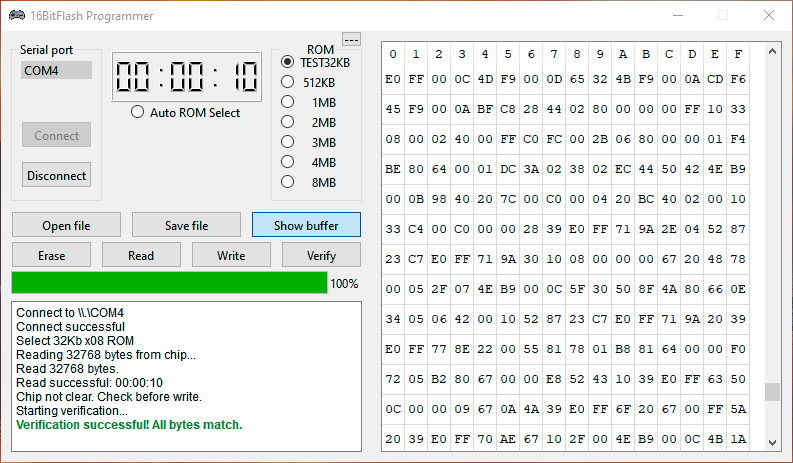

# 16BitFlash Programmer (SEGA Mega Drive / Genesis)

🌐 **Limbă / Язык:** [Русский](README.md) | Română

> 💡 **Istoria proiectului:** Proiectul a fost conceput inițial ca un simplu experiment educațional pentru a înțelege funcționarea portului COM, protocolului UART și transferului de date între PC și dispozitive externe, dar a evoluat într-un programator complet.

Programator bazat pe **Arduino NANO** (sau ESP8266) și **Qt 6 C++** pentru cipuri Flash pe 16 biți (seriile **MX29LV, AM29F, ES29LV, HY29F, S29AL**) și cartușe **SEGA Mega Drive / Genesis**.

---

## 🖥 Interfață și Funcții

* **Monitorizare:** Cronometru LCD și consolă pentru jurnale (loguri).
* **Selecție ROM:** Dimensiuni fixe (512 KB – 8 MB), `TEST 32KB` (test rapid) și modul inteligent `Auto ROM Select`.
* **Vizualizator Hex:** Fereastră integrată pentru vizualizarea memoriei (`Show buffer`) pe 16 coloane.
* **Operațiuni principale:** Citire, Scriere, Ștergere, Verificare.

---

## 🌟 Funcționalități Cheie

* **Auto ROM Select Inteligent:** Detectează automat dimensiunea fișierului. Dacă se potrivește cu un preset standard, selectează opțiunea; dacă nu, transmite microcontrolerului adresa finală exactă. Pentru dimensiuni mai mari de 4 MB (8 MB și 16 MB) este necesară lipirea liniilor de adresă $A21/A22$.
* **Viteza de Lucru:** Citirea 1 MB durează ~3.2 min (32 KB în 6 sec). Din cauza limitărilor hardware ale plăcii Arduino Nano (16 MHz), protocolului UART și I2C, scrierea este lentă — ~30 min per 1 MB.
* **Integrare Hardware:** Date pe 16 biți prin MCP23017 (I2C) / MCP23S17 (SPI), adrese prin registre 74HC595.
* **Byte Swapping Bidirecțional:** Conversia MSB/LSB se face automat la citire și scriere. Fișierele `.bin`, `.gen`, `.md` sunt gata direct de utilizare.
* **Testare Rapidă:** Opțiunea `TEST 32KB` permite verificarea instantanee a conexiunii fără întârzieri.
* **Verificare ROM:** Verificarea opțională a datelor după scriere, la dorință, prin butonul `Verify`.
* **Protecție Sistem:** Blocarea modului Sleep al PC-ului pe durata scrierii.

---

## 🔌 Schema de Conectare

### Magistrală Adrese (74HC595)
| Semnal | Arduino Nano | ESP8266 |
| :--- | :--- | :--- |
| **SER (Data)** | A0 | D4 |
| **L_CLK (Latch)** | A1 | D5 |
| **S_CLK (Clock)** | A2 | D3 |

### Linii Control Flash
| Semnal | Arduino Nano | ESP8266 | Descriere |
| :--- | :--- | :--- | :--- |
| **#CE** | D8 | D0 | Chip Enable (LOW) |
| **#OE** | D9 | D6 | Output Enable (LOW) |
| **#WE** | A3 | D7 | Write Enable (LOW) |

### Magistrală Date (MCP23017 / MCP23S17)

| (MCP23S17)    |       Arduino |
|     :---      |      :---     |
| pin #11 (CS)  | SPI CS   (10) |
| pin #12 (SCK) | SPI SCK  (13) |
| pin #13 (SI)  | SPI MOSI (11) |
| pin #14 (SO)  | SPI MISO (12) |

| (MCP23017)    | Arduino(ESP8266) |
|     :---      |       :---       |
| pin #12 (SCL) |  A5   (D2 ESP)   |
| pin #13 (SDA) |  A4   (D1 ESP)   |

---

## 💾 Cipuri Suportate

* **Seria MX29LV / MX29F:** MX29LV400, MX29LV800, MX29LV160, MX29LV320, MX29LV640, MX29F1615 etc.
* **Seria AM29 / S29:** AM29F800, S29AL016M și echivalente.
* **Altele:** ES29LV800D, HY29F800TT, M29W160ET, EN29LV160A.

---

## 📦 Lansări și software

* **Software pentru Windows:** În secțiunea **[Releases](../../releases/latest)** este disponibil pentru descărcare utilitarul de control în arhiva **`16BitFlash_Programmer_v2.0.4.7z`**, precum și codul sursă.

---

## 🛠 Hardware (Componente Hardware)

În depozit (repository) sunt incluse fișierele pentru asamblarea proprie a dispozitivului:
* **[Schema programatorului (PDF)](Hardware)** — Schema electrică principială în format PDF.
* **[Gerber:](Hardware)** — Fișiere Gerber gata pentru fabricarea cablajului imprimat (PCB).

---

## 👨‍💻 Autor

* **Dezvoltator:** Pushkash
* **Asistent AI:** Gemini
